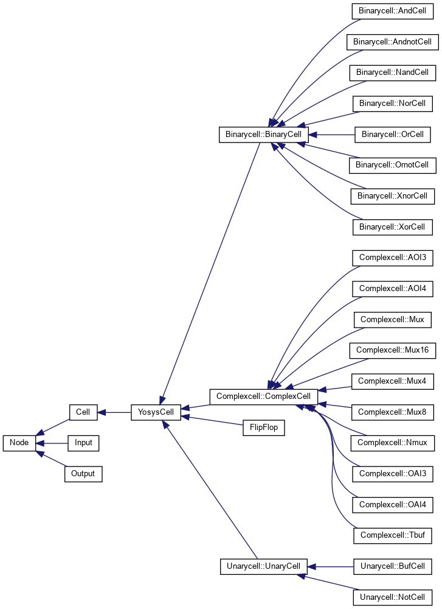
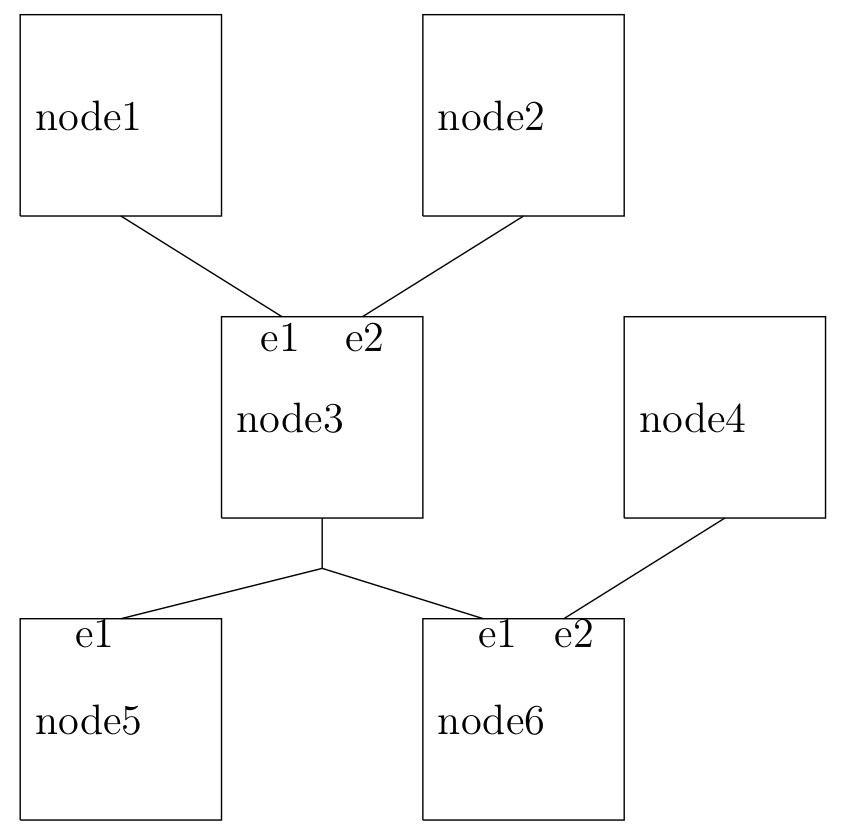
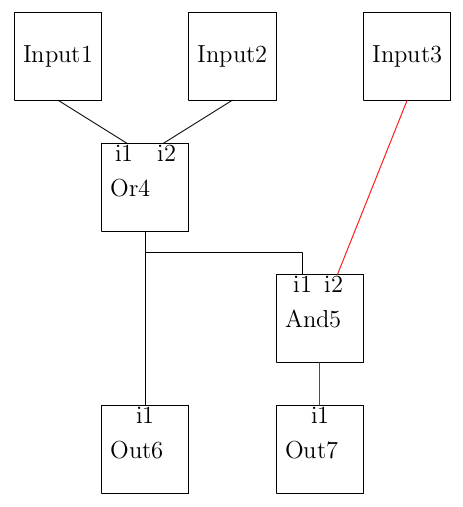
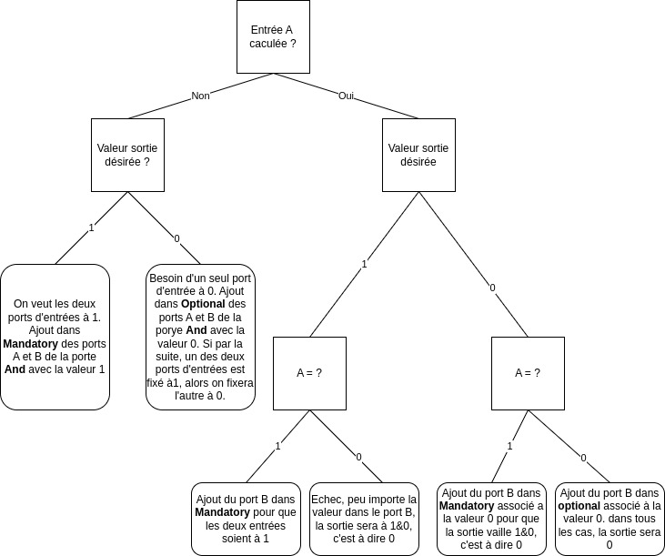

# ATPGK Project : an Automated Test Pattern Generator

**ATPGK** is an ATPG open-source software project for electronic circuits.
It is developed under the GNU GPL license. A copy of the license is supplied with the project.

## Summary

- [ATPGK Project : an Automated Test Pattern Generator](#atpgk-project--an-automated-test-pattern-generator)
  - [Summary](#summary)
  - [Build](#build)
    - [Prerequisites](#prerequisites)
    - [Conan configuration](#conan-configuration)
    - [Building the project](#building-the-project)
  - [Execution](#execution)
    - [Supported file extensions](#supported-file-extensions)
    - [Execution options](#execution-options)
  - [Use](#use)
    - [Input : Yosys](#input--yosys)
    - [Output : vectors](#output--vectors)
    - [Output : coverage](#output--coverage)
  - [Examples](#examples)
  - [Testing](#testing)
  - [Documentation](#documentation)
  - [Technical points](#technical-points)
    - [Dependencies](#dependencies)
    - [Command line options management](#command-line-options-management)
    - [Language management](#language-management)
    - [Project structure \& workflow](#project-structure--workflow)
    - [Internal circuit structure](#internal-circuit-structure)
      - [1. `Node`](#1-node)
      - [2. `Tree`](#2-tree)
    - [API : Builder](#api--builder)
      - [1. `CreateNewCell`](#1-createnewcell)
      - [2. `addInputToTree`](#2-addinputtotree)
      - [3. `addNodeToTree`](#3-addnodetotree)
      - [4. `createAndAddNodeToTree`](#4-createandaddnodetotree)
      - [5. `print_nodes`](#5-print_nodes)
      - [6. `bind_cell`](#6-bind_cell)
    - [API : Fault](#api--fault)
      - [1. `computeValue`](#1-computevalue)
      - [2. `get_vector_error`](#2-get_vector_error)
      - [3. `generate_vector_error`](#3-generate_vector_error)
      - [4. `computeMandatoryList`](#4-computemandatorylist)
      - [5. `computeOptionalFirstElem`](#5-computeoptionalfirstelem)
      - [6. `generateVectorError`](#6-generatevectorerror)
    - [Vector generation](#vector-generation)
      - [How to see Faults ?](#how-to-see-faults-)
      - [Propagate errors to inputs and outputs](#propagate-errors-to-inputs-and-outputs)
      - [Fault propagation algorithm](#fault-propagation-algorithm)
    - [Fault Model](#fault-model)
  - [Project file tree](#project-file-tree)
  - [Contributors](#contributors)

## Build

### Prerequisites

In order to compile the project, you will need the following tools (you can install them directly with your package manager such as `apt`) :

- [`cmake`](https://cmake.org/) (minimum version required is `v3.22`)
- A `C++` compiler (`gcc`, `clang`, `cl` ...)
- [`conan`](https://github.com/conan-io/conan) (minimum version required is `v2.X`)

### Conan configuration

Once you have system-wide installed `conan`, you will need to create a specific `profile` to use it. You can achieve it as follow :

```bash
conan profile detect
```

This will create a `default` profile (you can find and edit this profile at `<userhome>/.conan2/profiles/default`).

### Building the project

To build the project, you only have to be in the `root` of the project tree and execute the building script `build.sh` :

```bash
./build.sh
```

This script will install all the required denpendencies using `conan`, generate a CMake toolchain to properly include these libraries, run `cmake` to generate the build files and then build the project using `make` with the generated `Makefiles`.

## Execution

Once build, you will find the main executable of ATPGK named `ATPGK` in the folder named `./build`

You can run `ATPGK` in command-line as follow :

```bash
./ATPGK [--ext <file_extension>] [--options] <filename>
```

You can also run it shorter (for JSON input files only) :

```bash
./ATPGK <filename>
```

Here is a basic example with a netlist provided in the `examples/` folder (assuming you are in the root folder of the project):

```bash
./build/ATPGK ./exemples/4_Binary/netlist.json
```

You will find the output files in the `out/` folder. For more examples, refer to [example](#examples).

**Note** : if no specific path is specified with the `--out-path` (`-p`) option, output files are automatically generated in an `out/` directory at the location where the command was run.

### Supported file extensions

By now, only `JSON` input files are supported. You have to use `--ext json` as `file_extension` option in your command-line.

Note that the default value of `--ext` if not specified is `json`.

### Execution options

```text
  -h [ --help ]                         Produce help message and quit
  -v [ --version ]                      Print current version of the program 
                                        and quit
  --ext arg (=json)                     Extension type
  --file arg                            Name of the input file to process
  --license                             Print terms and conditions of the 
                                        software license and quit
  -o [ --output ] arg (=vectors.txt)    Specify the name of the output file 
                                        that contains the test vectors
  -O [ --output-type ] arg              Specify the extension type of the 
                                        output file that contains the test 
                                        vectors
  -c [ --coverage ] arg (=coverage.txt) Specify the name of the output fault 
                                        coverage file
  -C [ --cov-type ] arg                 Specify the extension type of the 
                                        output fault coverage file
  -p [ --out-path ] arg (=./out/)       Specify the path for the output
                                        directory
```

## Use

### Input : Yosys

This project is initially design to support gate-level netlist generated by [Yosys](https://yosyshq.readthedocs.io/projects/yosys/en/latest/index.html#) as input file. It is fully compatible with [`Yosys v0.9 (git sha1 1979e0b)`](https://github.com/YosysHQ/yosys)

As this project is still in its early stages, it is by no means complete or exhaustive. At its current stage of development, ATPGK only supports purely combinatorial circuits (no flip-flops, registers or memory, nor any circuit with a sequential aspect). Support for sequential circuits will be the subject of future development.

Below is the list of combinatorial operations supported by the software (see [Yosys gate definition](https://yosyshq.readthedocs.io/projects/yosys/en/latest/CHAPTER_CellLib.html#gates) for more information) :

`buf`, `not`, `and`, `nand`, `and-not`, `or`, `nor`, `or-not`, `xor`, `xnor`, `and-or 3 inputs (aoi3)`, `and-or 4 inputs (aoi4)`, `or-and 3 inputs (oai3)`, `or-and 4 inputs (oai4)`, `mux (multiplexer)`

It is absolutely necessary to have a netlist containing only one module as input. To obtain such a netlist with Yosys, you need to define a top-level module in your frontend. To do this, use the `hierarchy` command with the `-top` option as follows: `hierarchy -top <MyTopModule>`.

To flatten the netlist and remove unnecessary modules, you must then use the `flatten` command (after synthesis has been performed with the `synth` command).

Here is an example of a basic synthesis script for Yosys (if you have several frontends, add `read_verilog` lines with the different files):

```bash
# Read the Verilog files
read_verilog <MyVerilogFrontendFile.v>

# Define the top-level module of the hierarchy
hierarchy -check -top <MyTopLevelModule>

# Perform the synthesis of the design
synth

# Flatten the design
flatten

# Optimize the design
opt

# Convert the design to gate-level netlist
write_json <OutputNetlist.json>
```

To execute an Yosys script, use the following command :

```bash
yosys -s <script.ys>
```

Failure to follow these steps may result in a JSON netlist with a multi-module definition, which is not currently supported by the ATPGK project. Using a multi-module netlist as an input file may result in indeterminate kernel behavior.

**Note** : You can also run `yosys` to open the Yosys CLI, then execute all the above commands one by one.

### Output : vectors

These files contain the vectors generated by the ATPGK tool to test the input circuit. You'll find the definition of the circuit inputs and outputs, and the corresponding bits for each test vector.

Each input and output port of the circuit is assigned a bit value, which can take the following form:

- `1` : `1` logic
- `0` : `0` logic
- `-1` : means that the value is indeterminate (logic `0` or `1`, it doesn't matter).

At present, no optimization has been implemented for vector generation. Redundancies are therefore very likely. The optimization and sorting of test vectors during their generation will be the subject of future developments.

ATPGK v1.0 supported both TXT and JSON output generation.

- **TXT** :

General pattern :

```txt
Generated by ATPGK v1.0

Source file : ...

Generation date : ...

Input list :
 Name : ... ; Id : ...
 Name : ... ; Id : ...
 Name : ... ; Id : ...

Output list :
 Name : ... ; Id : ...
 Name : ... ; Id : ...


------------- Generated vectors -------------

Vector nb.1
 A : ... ; B : ... ; Y : ... ; 

Vector nb.2
 A : ... ; B : ... ; Y : ... ; 

Vector nb...

```

- **JSON** :

General pattern :

```json
{
 "creator": "Generated by ATPGK v1.0",

 "Source_file": "...",

 "Generation_date": "...",

 "Input_list": {
  "x": {
   "Id": "..."
  },
  "y": {
   "Id": "..."
  }
 },

 "Output_list": {
  "z": {
   "Id": "..."
  }
 },

 "Vectors": {
  "1": {
   "Input_bits": {
    "x": ...,"y": ...
   },
   "Output_bits": {
    "z": ...
   }
  },
  "...": {...}
 }
}
```

### Output : coverage

These files contain information about the software's coverage of faults in the circuit.

There are two reasons why a fault detected by the ATPGK tool may not be covered:

1) ***Controllability***: a fault may be impossible to test because the circuit design prevents the propagation of a specific value required for testing in certain parts of the circuit. In this case, the `co` flag is associated with the gate where the fault could not be tested.

2) ***Observability***: a fault may take too many clock cycles to propagate, in which case it may become unobservable by the tool. In this case, the `ob` flag is associated with the gate.

ATPGK v1.0 supported both TXT and JSON output generation.

- **TXT** :

General pattern :

```txt
Generated by ATPGK v1.0

Source file : ...

Generation date : ...

Tested Faults :

 - Stuck-at-0 : .../...
    Cell name : ... ; Reason : ...
    ...

 - Stuck-at-1 : .../...

 - ...
```

- **JSON** :

General pattern :

```json
{
 "Creator": "Generated by ATPGK v1.0",

 "Source_file": "...",

 "Generation_date": "...",

 "Tested_faults": {

  "Stuck-at-0": {
   "number": "...",
   "failure": "...",
   "gates_in_failure": [ 
    {
     "gate_name": "...",
     "reason": "..."
    }
   ]
  },

  "Stuck-at-1": {
   "number": "...",
   "failure": "...",
   "gates_in_failure": [ ]
  }
 }
}
```

## Examples

You can find complete examples with verilog files, Yosys synthesis scripts, their Yosys-generated JSON netlist and the corresponding SVG files generated with the [netlistsvg](https://github.com/nturley/netlistsvg) tool in the `examples` folder.

Refer to `examples/README.md` for more information on examples.

## Testing

You can run all the tests using the `build.sh` script in the `root` of the project with `test-all` as first argument. This will run all the written tests with `ctest` using the `GTest` library.

```bash
./build.sh test-all
```

However, as our priority is the implementation of a first functional scope (support for combinatorial circuits), the battery of unit tests provided is relatively thin.

Nevertheless, you'll find a set of JSON netlists for all elementary gates with their truth tables in the `test/benchmark/Yosys_gates/` folder.
It would of course be desirable to extend the unit test battery at a later date, in order to make it exhaustive and validate a high level of confidence in the behavior of the ATPGK tool.

## Documentation

To generate the project documentation using [`Doxygen`](https://www.doxygen.nl/), you have to first verify that it is wide-system installed on your computer.

You have to be in the `root` of the project tree, and then use the following command :

```bash
doxygen ./Doxyfile
```

You will find the main entrypoint to the documentation of the project named `index.html` in the folder `./doc`

## Technical points

### Dependencies

As specified before, the library dependencies are managed by `conan`. It ensures that all the dependencies are properly installed and available for the project source code.

This project relies on the following libraries :

- [`boost v1.83.0`](https://github.com/boostorg/boost/releases/tag/boost-1.83.0)
- [`nlohmann_json v3.10.4`](https://github.com/nlohmann/json/releases/tag/v3.10.4)

For testing this project, the following library is also required :

- [`gtest v1.14.0`](https://github.com/google/googletest/releases/tag/v1.14.0)

### Command line options management

To manage the options of the command line, we use the `Boost::Program_options` dedicated library. You can find the user manuel [here](https://scicomp.ethz.ch/public/manual/Boost/1.55.0/program_options.pdf).

The allowed options are defined in the `main` and the command line is parsed right after. This makes it easy to store command line option values in dedicated variables, and to assign them a default value if the option is not specified.

### Language management

Language management is based on JSON files, which are parsed to obtain the corresponding character strings.

For the moment, only English (en_US) and French (fr_FR) are supported. You can find the corresponding files (`en.json` and `fr.json`) in the `lang/` directory.

JSON files are structured as follows:

```JSON
{
  "group_1": {
    "string_name_1": "string content in a specific language",
    "string_name_2": "string content in a specific language"
  },
  "group_2": {
    "...": "..."
  }
}
```

**Note 1** : When defining a new language file, its name must correspond to the ICU description of the language (see [ISO 639 standard](https://www.iso.org/fr/iso-639-language-code.html) -> [list of ICU code](https://www.localeplanet.com/icu/iso639.html)) -> *Exemple : es.json (for spanish)*

**Note 2** : When defining a new language file, all existing string entries must be redefined. The current version of the software does not support default files (in English, for example). This means that if all entries are not redefined, they will simply not be displayed by the software, and may even result in an error when searching for the string in the JSON object.

**Note 3** : The json file is parsed in the `main.cpp` file and the JSON object is defined as a global variable. To include it in another module file, simply add it as an external variable in your `.hpp` header file:

```C++
extern json strings
```

See `<project_root>/include/reader/reader.hpp` as example. If this is not already the case, add `#include <nlohmann/json.hpp>` in your header file.

You can then use the strings as follow :

```C++
strings["group_name"]["string_name"].get<std::string>()
```

### Project structure & workflow

Here's an overview of the project's structure, the various modules that make it up and how they interact with each other:


To summarize the above diagram, here is the general software workflow:

1. The `parser` reads the input file, parse the netlist and stores the parsed netlist in the `reader`
2. The `reader` calls the `builder API`, which reads the parsed netlist to build the circuit model
3. The `top-level` structure calls the `decorator`, who reads the fault model and visits each circuit model cell. He then decorates the circuit model with the faults to be tested and fills in the fault list.
4. The `top-level` structure calls the `Fault API`, which reads the fault list and generates all test vectors.
5. The `top-level` structure calls the vector `writer`, which reads the list of vectors to generate the output file containing the vectors.
6. The `top-level` structure generate the coverage statistics and calls the coverage `writer`, which reads the list of faults to generate the coverage output file.

### Internal circuit structure

In order to model the circuit described by the input netlist, we have developed an internal structure. The purpose of this structure is to identify potential faults in the circuit and then generate the test vectors associated with these faults. To represent the circuit, we have opted for a **graph** structure. The structure is composed solely of nodes (`Node`), symbolizing the cells and inputs/outputs of the circuit. These nodes are linked not by other objects, but directly within themselves, each node describing a list of parent and child nodes (our structure is therefore a **directed graph**). What's more, the `Node` structure implements the notion of port. A node is linked to child or parent nodes via its ports. For the moment, there is no check on the acylycity of the graph. However, this logic will be added to the structure with the aim of extending the circuits supported by ATPGK to sequential circuits (transforming our structure into a Directed Acyclic Graph or DAG). The entire graph is stored in an (admittedly misnamed) `Tree` structure. Next sections are a description of the `Node` and `Tree` classes.

#### 1. `Node`

The `Node` class is an abstract class representing a logic gate. All the different logic gates are concrete classes implementing the `Node` class. Below is an overview of the inheritance tree of classes representing electronic cells, from the most general (`Node`) to the most specific. For the moment, we've only implemented the cells specific to Yosys' default gate-level technology (whose definition you'll find [here](https://yosyshq.readthedocs.io/projects/yosys/en/latest/CHAPTER_CellLib.html#gates)) :



As mentioned above, the project is still in its early stages, and we have not yet implemented sequential logic support in the circuits. So you'll find an abstract class called `FlipFlop`, which no other class has yet inherited, and an old branch on the original Git repository called `FlipFlopFiles`, which contains all the files for the `FlipFlop` subclasses (which were created at the very beginning of the project and are completely out of date). In the future, it will be necessary to implement these classes in order to extend ATPGK software support to sequential circuits. For this purpose, it will probably be necessary to turn the internal structure into a true DAG (i.e. add verification of the structure's acyclicity).

The main attributes of the `Node` class are :

- *children*: a tuple vector of two elements representing the list of children of the node (meaning: gates whose input is connected to the output of the gate represented by node). Each tuple contains a node and an integer. The node represents another node in the circuit, and the integer represents the number of the input through which the connection is made (in the child node).

- *parents*: a tuple vector of two elements representing the list of node parents (meaning: gates whose output is linked to one of the inputs of the gate represented by node). Each tuple contains a node and an integer. The node represents another node in the circuit, and the integer represents the number of the input through which the connection is made (in the child node).

Here's an example to illustrate:



In this figure, node 1 is linked to input 1 (e1) of node 3. node2 is linked to input 2 (e2) of node 3. node 3 is linked to input 1 (e1) of node 5. node 3 is linked to input 1 (e1) of node 6. node 4 is linked to input 2 (e2) of node 6. Here are the `Children` and `Parents` vectors for each `Node`. In each parenthesis, there is a tuple contained in the vector:

|        | **Vecteur Children**   | **Vecteur Parents**    |
|--------|------------------------|------------------------|
|  Node1 | (node3, 1)             | vide                   |
|  Node2 | (node3, 2)             | vide                   |
|  Node3 | (node5, 1), (node6, 1) | (node1, 1), (node2, 2) |
|  Node4 | (node6, 2)             | vide                   |
|  Node5 | vide                   | (node3, 1)             |
|  Node6 | vide                   | (node3, 1), (node4, 2) |

#### 2. `Tree`

The Tree represents the circuit in its entirety. It contains three
attributes:

- *NodeList*: contains the list of all nodes present in the tree, i.e. the list of all gates present in the circuit.

- *InputList*: contains the list of all inputs present in the circuit.

- *OutputList*: contains a list of all the inputs present in the circuit.

Note that inputs are stored in both NodeList and InputList. Similarly, outputs are present in both NodeList and OutputList.

For more information on this internal structure, please refer to the technical documentation (see [Documentation](#documentation)).

### API : Builder

The BuilderAPI is a C++ module that provides an API for creating and manipulating a circuit model tree. It allows users to build circuits by defining cells, adding input nodes, connecting nodes, and printing information about the constructed circuit.

#### 1. `CreateNewCell`

```cpp
shared_ptr<Node> createNewCell(size_t id, string type, std::string netlistName);
```

Creates a new cell with the specified identifier, type, and netlist name.

- **id**: Unique identifier for the new cell.
- **type**: Type of the cell to be created.
- **netlistName**: The name of the cell in the netlist.

**Returns**: A shared pointer to the newly created cell node.

#### 2. `addInputToTree`

```cpp
void addInputToTree(shared_ptr<Tree> tree, shared_ptr<Node> node);
```

Adds an input node to the specified circuit model tree.

- **tree**: The target circuit model tree.
- **node**: The input node to be added.

#### 3. `addNodeToTree`

```cpp
void addNodeToTree(shared_ptr<Tree> tree, shared_ptr<Node> node);
```

Adds an input node to the specified circuit model tree.

- **tree**: The target circuit model tree.
- **node**: The node to be added.

#### 4. `createAndAddNodeToTree`

```cpp
void createAndAddNodeToTree(shared_ptr<Tree> tree, size_t id, string type, std::string netlistName);
```

Creates and adds a node to the specified circuit model tree with the given identifier, type, and netlist name.

- **tree**: The target circuit model tree.
- **id**: Unique identifier for the new node.
- **type**: Type of the node to be created.
- **netlistName**: The name of the cell in the netlist.

#### 5. `print_nodes`

```cpp
void print_nodes(shared_ptr<Tree> tree);
```

Prints information about the nodes in the specified circuit model tree.

- **tree**: The target circuit model tree.

#### 6. `bind_cell`

```cpp
void bind_cell(size_t id_parent, size_t id_children, string port, shared_ptr<Tree> tree);
```

Binds a cell to the tree by specifying the parent and child nodes and the connecting port.

- **id_parent**: Unique identifier of the parent node.
- **id_children**: Unique identifier of the child node.
- **port**: Port through which the child node is connected to the parent node.
- **tree**: The target circuit model tree.

### API : Fault

The FaultAPI is a C++ module designed to handle fault computation and error generation in the context of a circuit model. This API works in conjunction with the BuilderAPI, allowing users to create and manipulate a circuit model tree and then analyze potential faults and errors in the system.

#### 1. `computeValue`

```cpp
void computeValue(std::vector<std::pair<shared_ptr<Node>, int>> &input_vector, std::vector<std::pair<shared_ptr<Node>, int>> &output_vector, shared_ptr<Node> node, int value, int input_number);
```

Computes the value of a node based on input vectors.

- **input_vector**: A vector of input nodes and their corresponding values.
- **output_vector**: A vector to store output nodes and their computed values.
- **value**: The value to compute for the node.
- **input_number**: The input number for which to compute the value.
- **node**: The node for which to compute the value.

#### 2. `get_vector_error`

```cpp
std::pair<std::vector<std::pair<shared_ptr<Node>, int>>, std::vector<std::pair<shared_ptr<Node>, int>>> get_vector_error(int value, shared_ptr<Tree> tree, shared_ptr<Node> node, int port_number);
```

Gets error vectors for a node based on a specific fault.

- **value**: The value to generate error vectors for.
- **tree**: The circuit model tree.
- **node**: The node for which to generate error vectors.
- **port_number**: The port number for which to generate error vectors.

**Returns**: A pair of vectors representing input and output nodes with error values.

#### 3. `generate_vector_error`

```cpp
std::vector<std::pair<std::vector<std::pair<shared_ptr<Node>, int>>, std::vector<std::pair<shared_ptr<Node>, int>>>> generate_vector_error(std::shared_ptr<std::vector<std::pair<shared_ptr<Fault>, shared_ptr<Node>>>> fault_list, shared_ptr<Tree> tree);
```

Generates error vectors for a list of faults in the circuit model.

- **fault_list**: A list of faults in the circuit model.
- **tree**: The circuit model tree.

**Returns**: A vector of pairs, each containing input and output nodes with error values for a specific fault.

#### 4. `computeMandatoryList`

```cpp
bool computeMandatoryList(std::vector<std::tuple<std::shared_ptr<Node>, int, int, bool>>& mandatory, std::vector<std::tuple<std::shared_ptr<Node>, int, int, bool>>& optional);
```

Computes the mandatory list of faults.

- **mandatory**: A vector of mandatory faults.
- **optional**: A vector of optional faults.

**Returns**: `true` if successful; otherwise, `false`.

#### 5. `computeOptionalFirstElem`

```cpp
bool computeOptionalFirstElem(std::vector<std::tuple<std::shared_ptr<Node>, int, int, bool>>& mandatory, std::vector<std::tuple<std::shared_ptr<Node>, int, int, bool>>& optional);
```

Computes the first element of the optional list.

- **mandatory**: A vector of mandatory faults.
- **optional**: A vector of optional faults.

**Returns**: `true` if successful; otherwise, `false`.

#### 6. `generateVectorError`

```cpp
std::vector<std::pair<std::vector<std::pair<shared_ptr<Node>, int>>, std::vector<std::pair<shared_ptr<Node>, int>>>> generateVectorError(std::shared_ptr<std::vector<std::pair<shared_ptr<Fault>, shared_ptr<Node>>>> fault_list, shared_ptr<Tree> tree);
```

Generates error vectors for a list of faults in the circuit model.

- **fault_list**: A list of faults in the circuit model.
- **tree**: The circuit model tree.

**Returns**: A vector of pairs, each containing input and output nodes with error values for a specific fault.

### Vector generation

#### How to see Faults ?

A vector is generated for each fault that is tested. A fault corresponds to a value assigned to a port of a logic gate (to test the value in this port), and the aim is to generate the input vector to obtain this value in this port, check that it is correct and calculate the output vector corresponding to this input vector. To test a value on one port of a logic gate, the value of the other ports must be adequate and allow the visualization of a value change at the output of the logic gate if the fault is present. For example, if the aim is to test for a fault on port A of a `AND` gate, we need to ensure that port B is set to 1. Since B is set to 1, we know that if A is set to 1, the output will be `1&1`, i.e. 1. On the other hand, if A is set to 0, the output will be `1&0`, i.e. 0. This method therefore allows us to see a fault on the output when port A of a `AND` gate is tested.

#### Propagate errors to inputs and outputs

Once we know how to observe an error on a logic gate, we need to propagate the observation of this error to the output. To do this, each gate between the gate under test and the circuit outputs must have an output that depends on the output value of the gate under test. So each of these gates must behave in such a way as to visualize the fault at the circuit output, as seen previously. On the other hand, when we look for values to assign to the circuit inputs, we're not looking to propagate the output value of the gate under test, but rather to retropropagate the fixed input values of this gate. In other words, we just want to rewind the circuit to obtain the various input values required to obtain a 1 or a 0 on the output port of the gate under test.

In this way, we understand that not all the gates in a circuit behave in the same way at the time of a test: some have the role of allowing the fault to be displayed at the output, while others have the role of generating this specific output value on the gate under test.

Here's an example to illustrate what we've just said:



In this circuit, if the output of the `Input3` port is to be tested, the `And5` port must be used to display the output fault. Port `i1` of the `And5` gate must therefore be set to `1`. The `Out7` output is used to display whether a fault has occurred. The `Or4` port is not used to observe a value. However, its role is to output a `1`, so that the `i1` output of the `And5` gate is set to `1`. To achieve this, it is sufficient for one of its two inputs to be set to `1`, so that the value of the other input has no effect on the output.

#### Fault propagation algorithm

Once we know how to observe a fault on a logic gate, and understand the role of the different gates in visualizing a fault, the algorithm for generating test vectors can work. This algorithm is based on a function called `computeMandatory` present in each class representing a logic gate (in each class inheriting from `Node`). This function takes two tuple vectors as arguments: `mandatory` and `optional`. These tuple vectors both contain values to be assigned to ports in the various `Node`. The difference between these two lists is that values in mandatory must be assigned to the given port of the associated `Node`, whereas those in optional are just assigned at the end, if the given port of the associated `Node` doesn't contain an already-assigned value. The algorithm also takes as argument a propagate boolean used to identify whether the logic port is a port used to display an error. In the case of the previous figure, this boolean would be set to `true` when the `And5` port `i2` is assigned. On the other hand, it would be `false` when the output port of the `Or4` gate is set to `1`.

Here's an example illustrating some of the possibilities when you set the output of an `And` door and then want to find its inputs:



### Fault Model

For the moment, ATPGK v1.0 only covers stuck-at-0 and stuck-at-1 faults at cell output. The fault object are created by the `FaultDecorator` (defined in the `FaultDecorator.hpp` file).

The fault model used by the tool is defined in the `FaultModel` namespace (in the `Fault.hpp` file).

If you want to define more type of faults in your model, you will have to extend the `enum class FaultModelType`. Don't forget to define the aliases linked to the new fault to be able to get its name.

## Project file tree

```text
.
├── examples                        # Liste des exemples fournis pour prendre en main l'outil
│   ├── 1_And
│   ├── 2_AOI4
│   ├── 3_Nand
│   ├── 4_Binary
│   └── README.md
├── include                         # Ensemble des fichier header (.hpp)
│   ├── atpg_top
│   ├── builder_API
│   ├── fault_API
│   ├── parser
│   ├── reader
│   ├── tree
│   │   └── Yosys
│   ├── utils
│   └── writer
├── lang                            # Fichiers de tranduction des strings
│   ├── en.json
│   └── fr.json
├── src                             # Fichiers sources du projet (.cpp)
│   ├── atpg_top
│   ├── builder_API
│   ├── fault_API
│   ├── parser
│   ├── reader
│   ├── tree
│   │   └── Yosys
│   ├── writer
│   └── main.cpp                    # Main entrypoint
├── test                            # Ensemble des fichiers de test
│   ├── benchmark                   # Fichiers Verilog et netlists JSON pour tester le circuit
│   │   ├── Combinatory_circuits
│   │   ├── Yosys_gates
│   │   ├── synth.sh
│   │   └── synth.ys
|   ├── test_main.cpp
│   └── test_yosys_json_parser.cpp
├── build.sh                        # Fichier initial pour lancer le build du projet
├── CMakeLists.txt                  # Fichier de configuration CMake
├── conanfile.txt                   # Fichier conan pour déclarer les dépendances
├── config.h.in
├── COPYING                         # Licence GNU GPL
├── Doxyfile                        # Fichier de configuration Doxygen pour générer la documentation
└── README.md                       # Manuel utilisateur
```

## Contributors

| Name                                                     | Slack Handle | E-mail                   |
| -------------------------------------------------------- | ------------ | ------------------------ |
| [Hugo Brisset](https://gitlab.ensimag.fr/brisseth)       | @brisseth    | <hugo.brisset@proton.me> |
| [Gabriel Lévy](https://gitlab.ensimag.fr/levyg)          | @levyg       | <gabriel.levy@skiff.com> |
